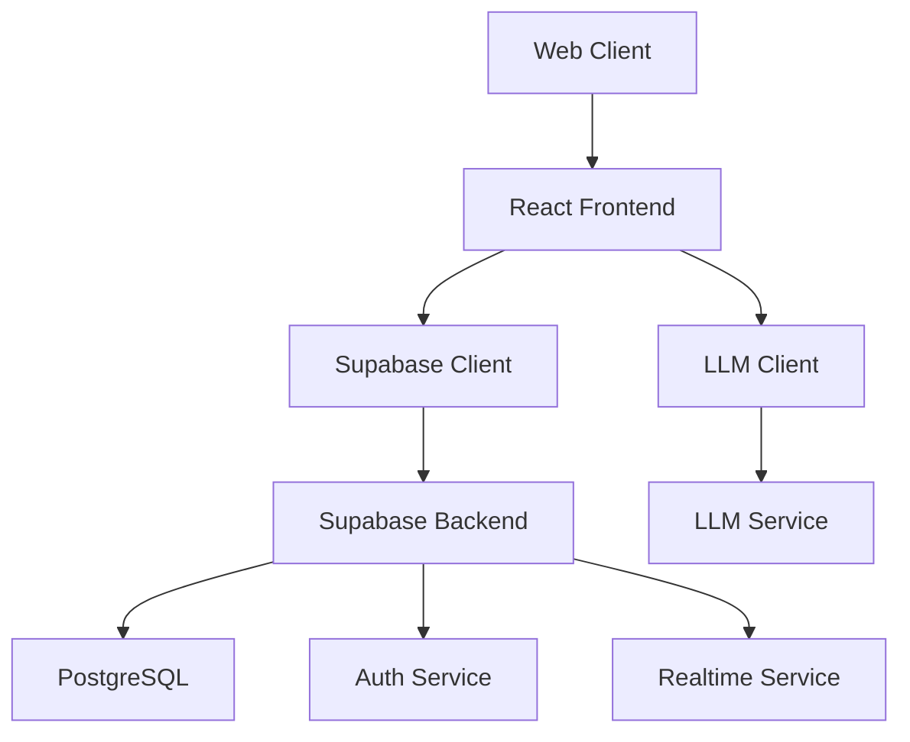

# Epic Saga Builder

Epic Saga Builder is a collaborative storytelling platform where players and AI work together to create immersive fantasy adventures. The platform combines human creativity with AI-powered narration to create unique, dynamic stories that evolve based on player actions.

## Features

- **Collaborative Storytelling**: Multiple players can join stories and shape the narrative together
- **AI-Powered Narration**: Advanced language models provide dynamic responses to player actions
- **Rich Character Creation**: Create detailed characters with unique backgrounds and abilities
- **Real-time Updates**: See story developments as they happen
- **Responsive Design**: Works seamlessly on desktop and mobile devices

## Solution Architecture

### Overview

Epic Saga Builder follows a modern web application architecture with these key components:

1. **Frontend Layer**
   - React-based SPA with TypeScript
   - Real-time updates using Supabase Realtime
   - Responsive UI with Tailwind CSS
   - Client-side routing with React Router

2. **Backend Services**
   - Supabase for database and authentication
   - LLM service (GPT4All locally or a SaaS LLM like OpenAI, DeepSeek etc in production)
   - Real-time messaging system

3. **Data Storage**
   - PostgreSQL database (managed by Supabase)
   - Row Level Security for data protection
   - Real-time subscriptions for live updates

### Key Components

### Data Flow

1. User actions trigger state changes in React components
2. Data mutations are sent to Supabase
3. Real-time subscriptions notify all connected clients
4. LLM service processes story actions and generates narrations
5. Updates are broadcasted to all story participants

## Important Project Files

### Core Application Files

- `src/App.tsx` - Main application component and routing setup
- `src/contexts/AuthContext.tsx` - Authentication context provider
- `src/lib/supabase.ts` - Supabase client configuration

### Story Management

- `src/lib/session-manager.ts` - Manages story sessions and player actions
- `src/lib/story-service.ts` - Story-related database operations
- `src/lib/character-service.ts` - Character management operations

### LLM Integration

- `src/lib/llm.ts` - LLM service integration
- `src/lib/llm-factory.ts` - Factory for LLM service creation
- `src/lib/llm-prompts.ts` - System prompts and templates
- `src/lib/mock-llm.ts` - Mock LLM for development

### Key Components

- `src/components/StoryConsole.tsx` - Main story interaction interface
- `src/components/StoryMessage.tsx` - Message display component
- `src/components/CharacterList.tsx` - Character roster display
- `src/components/AuthModal.tsx` - Authentication interface

### Database Schema

The database structure is defined in migration files under `supabase/migrations/`:

- Users table: Player accounts and profiles
- Stories table: Story metadata and settings
- Characters table: Character data and relationships
- Story Messages table: Story progression and interactions

## Local Development Setup

### Prerequisites

1. Node.js 18+ and npm
2. GPT4All with a LLM model (tested with "Llama 3.2 3B Instruct") or a SaaS LLM like Open AI, DeepSeek, Google AI etc
3. Supabase account (free tier works fine)
4. Git (optional, for version control)

### Step 1: Install GPT4All

1. Download GPT4All from [https://gpt4all.io](https://gpt4all.io)
2. Install and run GPT4All
3. Download the "Llama 3.2 3B Instruct" model
4. Enable "Local API Server" in settings and set port to 4891

### Step 2: Clone and Setup Project

\`\`\`bash
# Clone repository
git clone https://github.com/yourusername/epic-saga-builder
cd epic-saga-builder

# Install dependencies
npm install

# Copy environment file
cp .env.example .env
\`\`\`

### Step 3: Configure Environment Variables

Edit \`.env\` file:

\`\`\`env
VITE_SUPABASE_URL=your_supabase_url
VITE_SUPABASE_ANON_KEY=your_supabase_anon_key
# Set VITE_USE_MOCK_LLM to false to integrate with a LLM API
VITE_USE_MOCK_LLM=true
VITE_LLM_API_ENDPOINT=http://localhost:4891/v1/chat/completions
VITE_LLM_MAX_TOKENS=128
VITE_LLM_MODEL_NAME="Llama 3.2 3B Instruct"
VITE_LLM_MAX_HISTORY=10
VITE_LLM_SYSTEM_PROMPT="You are a skilled RPG game master..."
\`\`\`

### Step 4: Setup Database

1. Create a new Supabase project
2. Click "Connect to Supabase" button in the app
3. Run migrations from \`supabase/migrations\` folder

### Step 5: Run Development Server

\`\`\`bash
npm run dev
\`\`\`

Visit \`http://localhost:5173\` to see the app running.

## Cloud Deployment Guide

### Prerequisites

1. Account with a cloud platform like Netlify or AWS (tested with Netlify free tier)
2. Domain name (optional, but recommended)

Next steps assume AWS. It is easier to set it up with Netlify.

### Step 1: Setup AWS Resources

1. Create an S3 bucket for static hosting
2. Configure CloudFront distribution
3. Setup Route53 if using custom domain

### Step 2: Configure LLM Integration

1. Create account with a SaaS LLM like OpenAI API, DeekSeek, Google AI etc
2. Generate API key
3. Update environment variables:

\`\`\`env
VITE_LLM_API_ENDPOINT=https://api.openai.com/v1/chat/completions
VITE_LLM_API_KEY=your_openai_api_key
VITE_LLM_MODEL_NAME=gpt-3.5-turbo
\`\`\`

### Step 3: Deploy Frontend

\`\`\`bash
# Build project
npm run build

# Deploy to S3
aws s3 sync dist/ s3://your-bucket-name

# Invalidate CloudFront cache
aws cloudfront create-invalidation --distribution-id YOUR_DIST_ID --paths "/*"
\`\`\`

### Step 4: Setup Supabase Production Project

1. Create new Supabase project for production
2. Update environment variables with production credentials
3. Run migrations on production database

## Known Issues and Workarounds

### Local Development CORS Issues

For local development with GPT4All, you'll need to temporarily disable CORS in your browser:

#### Safari:
1. Open Safari / Settings / Advanced, check "Show features for web developers"
2. Open Develop / Developer Settings, under Security check "Disable cross-origin restrictions"
3. Open Safari / Settings for localhost, uncheck "Enable content blockers"

#### Chrome/Edge:
1. Create a shortcut with target:
   \`\`\`
   "C:\Program Files\Google\Chrome\Application\chrome.exe" --disable-web-security --user-data-dir="%LOCALAPPDATA%\Google\Chrome\User Data\Testing Profile"
   \`\`\`

#### Firefox:
1. Type \`about:config\` in address bar
2. Set \`security.fileuri.strict_origin_policy\` to \`false\`

⚠️ **IMPORTANT**: Only disable CORS for development! Re-enable security features when done testing.

### Production Considerations

For production deployment:
1. Use a SaaS LLM like OpenAI's API instead of a local LLM
2. Implement proper authentication for API calls
3. Setup rate limiting and usage monitoring
4. Configure proper CORS headers in your API gateway

## Dependencies

### Local Development
- Node.js 18+
- GPT4All with a LLM model (tested with "Llama 3.2 3B Instruct")
- Supabase (free tier)
- Modern web browser

### AWS Production
- OpenAI API account
- AWS services:
  - S3
  - CloudFront
  - Route53 (optional)
  - ACM for SSL (optional)
- Supabase (production tier recommended)

## Support

For issues and feature requests, please create an issue in the GitHub repository (https://github.com/pburglin/EpicSagaBuilder).

## License

This project is licensed under the GNU AFFERO GENERAL PUBLIC LICENSE - see the LICENSE file for details.